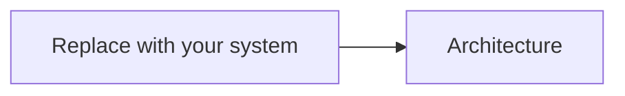

# Project Submission

<!--
This is the main document the jury will read.

Keep it concise.

Do not try to make the project look larger than it is.

Make it easy to distinguish:
- the complete system you propose;
- what you actually implemented;
- what is simulated or mocked;
- what remains only designed;
- what is deliberately out of scope.

This document should evolve throughout the Hackathon.
It is also used as part of the Thursday checkpoint.

Do NOT add the final commit SHA to this document.
The authoritative checkpoint and final SHAs are submitted separately
through the official submission forms.
-->

# 1. Project snapshot

|                               |                                                                                   |
| ----------------------------- | --------------------------------------------------------------------------------- |
| **Project name**              | <!-- Name -->                                                                     |
| **Team ID**                   | <!-- e.g. Team 07 -->                                                             |
| **Team members**              | <!-- Names -->                                                                    |
| **Problem**                   | <!-- One sentence -->                                                             |
| **Proposed contribution**     | <!-- One sentence -->                                                             |
| **What we actually built**    | <!-- One sentence -->                                                             |
| **Contribution area(s)**      | <!-- One or more contribution areas, or another relevant Proof of Aid problem --> |
| **Implementation dimensions** | <!-- UX X% · Real-world connection Y% · Blockchain Z% -->                         |
| **Code**                      | [`implementation/`](./implementation/)                                            |
| **Run instructions**          | [`implementation/README.md`](./implementation/README.md)                          |
| **Demo entry point**          | <!-- URL, command, screen, endpoint, script, etc. -->                             |

<!--
[ORGANIZERS: ADD PRE-EXISTING-WORK DISCLOSURE FIELD HERE IF THE FINAL RULES REQUIRE IT]
-->

---

# 2. Problem and solution

## The problem

<!--
In a few short paragraphs:

- What concrete Proof of Aid problem are you addressing?
- Who experiences it?
- Why is it worth solving?

Avoid describing the whole aid ecosystem.
-->

## Our approach

<!--
Explain the proposed solution at a high level.

A reviewer should understand what changes compared with the problem above.
-->

---

# 3. Complete system

This section describes the complete system you propose, including parts that were not implemented during the Hackathon.

## End-to-end flow

<!--
Describe the complete flow in approximately 4–8 steps.

Include the main actors naturally in the flow instead of creating
a large actor catalogue unless one is genuinely useful.
-->

1. <!-- Step -->
2. <!-- Step -->
3. <!-- Step -->
4. <!-- Step -->

## Architecture

<!--
Use a compact Mermaid diagram or an image stored in this repository.

Show components and meaningful interactions.
Do not represent every library or low-level implementation detail.

If using an image, use a relative repository path.
-->

## System scope

<!--
List the major parts of the proposed system.

Use these four statuses consistently:

Implemented
Simulated / mocked
Designed only
Out of scope
-->

| Component / capability | Purpose          | Status          |
| ---------------------- | ---------------- | --------------- |
| <!-- Item -->          | <!-- Purpose --> | <!-- Status --> |
| <!-- Item -->          | <!-- Purpose --> | <!-- Status --> |
| <!-- Item -->          | <!-- Purpose --> | <!-- Status --> |

---

# 4. Key decisions and trade-offs

<!--
Include only decisions that materially shaped the solution.

Relevant topics may include:
- architecture;
- data storage;
- trust assumptions;
- evidence;
- identity;
- privacy;
- security;
- blockchain vs off-chain responsibilities;
- external services;
- UX;
- simplifications made for the Hackathon.

Do not create decisions just to fill the template.

Two meaningful decisions are better than six obvious ones.
-->

## Decision 1 — <!-- Short name -->

**We chose:**

<!-- Decision -->

**Because:**

<!-- Why -->

**Trade-off / limitation:**

<!-- What this choice gains and gives up -->

## Decision 2 — <!-- Short name -->

**We chose:**

<!-- Decision -->

**Because:**

<!-- Why -->

**Trade-off / limitation:**

<!-- What this choice gains and gives up -->

<!-- Add another decision only if it materially helps explain the project. -->

---

# 5. What we implemented

## Implemented contribution

<!--
Explain what actually exists in the repository.

Focus on behaviour and architecture, not a list of files.

A jury member should understand immediately which part of the larger
system was actually built during the Hackathon.
-->

## How it works

<!--
Explain the important implementation mechanics.

Include only details needed to understand the contribution.

Examples:
- relevant state transitions;
- API interactions;
- contract logic;
- verification process;
- data flow;
- important algorithms;
- integration boundaries.
-->

## What is not real

<!--
Explicitly list anything involved in the prototype that is:

- mocked;
- simulated;
- hard-coded;
- manually triggered;
- replaced with test data;
- represented only conceptually.

If none, state that explicitly.
-->

Operational instructions are available in:

[`implementation/README.md`](./implementation/README.md)

---

# 6. Demo and validation

## What the demo proves

<!--
In one or two sentences:

What claim about your implementation should the jury believe
after seeing this scenario succeed?
-->

## Initial state

<!--
Describe only what must exist before step 1.

Examples:
- local services running;
- seeded data;
- test wallet;
- deployed test contract;
- mock verifier;
- demo account.

Reference implementation/README.md instead of duplicating detailed setup instructions.
-->

## Scenario

| Step | Action          | Expected observable result |
| ---: | --------------- | -------------------------- |
|    1 | <!-- Action --> | <!-- Result -->            |
|    2 | <!-- Action --> | <!-- Result -->            |
|    3 | <!-- Action --> | <!-- Result -->            |

## Validation evidence

<!--
Point to useful evidence where relevant.

Examples:
- automated tests;
- transaction hash;
- API output;
- logs;
- screenshot;
- resulting UI state;
- database state.

Do not add screenshots only for decoration.
-->

## Demo dependencies

<!--
If applicable, identify:

- deployed URL;
- safe test credentials;
- test network;
- wallet requirements;
- external API requirements;
- manually operated components;
- external services that must remain available.

Never commit secrets or real private keys.
-->

---

# 7. Limitations and next step

## Current limitations

<!--
List the few limitations that matter most.

Be concrete.
-->

* <!-- Limitation -->
* <!-- Limitation -->

## Next step

<!--
If you had more time, what is the single most important next technical
or product step?

Keep this short.
-->

---

# 8. AI usage

<!--
Document meaningful AI assistance.

You do not need to list trivial autocomplete usage.
-->

| Tool          | Used for         | Relevant assisted/generated work | How we reviewed or validated it |
| ------------- | ---------------- | -------------------------------- | ------------------------------- |
| <!-- Tool --> | <!-- Purpose --> | <!-- Work -->                    | <!-- Validation -->             |

We confirm that the team can explain and technically defend the submitted work.