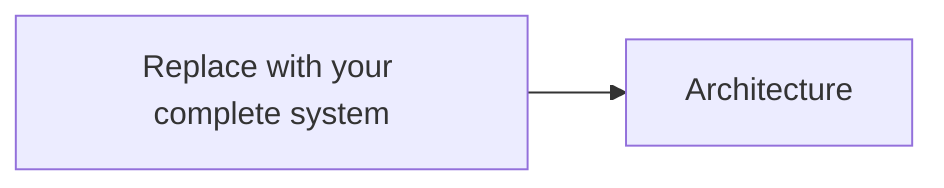

# Project Submission

<!--
This is the main document the jury will read.

Your submission has two different scopes:

1. COMPLETE SYSTEM DESIGN
   Show how your team would design Proof of Aid as a complete system.
   This is a broad design exercise. You are not expected to implement all of it.

2. IMPLEMENTED CONTRIBUTION
   Choose one meaningful part of that system, identify a concrete problem,
   and implement a demonstrable contribution in depth.

Keep these two scopes clearly separated.

Do not try to make the implementation look larger than it is.

Make it easy to distinguish:
- what belongs to the complete proposed system;
- what you chose to focus on;
- what you actually implemented;
- what is simulated or mocked;
- what remains designed only;
- what is deliberately out of scope.

This document should evolve throughout the Hackathon.
It is also used as part of the Thursday checkpoint.

Do NOT add the final commit SHA to this document.
The authoritative checkpoint and final SHAs are submitted separately
through the official submission forms.
-->

# 1. Project snapshot

|                                |                                                                                                                   |
| ------------------------------ | ----------------------------------------------------------------------------------------------------------------- |
| **Project name**               | <!-- Name -->                                                                                                     |
| **Team ID**                    | <!-- e.g. Team 07 -->                                                                                             |
| **Team members**               | <!-- Names -->                                                                                                    |
| **Complete system vision**     | <!-- In one sentence: what does your version of Proof of Aid enable or achieve? -->                               |
| **Implementation focus**       | <!-- In one sentence: which part of the complete system did you choose to explore in depth? -->                   |
| **Concrete problem addressed** | <!-- In one sentence: what specific problem does your implementation address? -->                                 |
| **Contribution area(s)**       | <!-- Claims & Lifecycle / Trust, Evidence & Privacy / Funding / Delivery & Impact / Transparency & UX / Other --> |
| **What we actually built**     | <!-- One sentence describing the implemented artifact -->                                                         |
| **Code**                       | [`implementation/`](./implementation/)                                                                            |
| **Run instructions**           | [`implementation/README.md`](./implementation/README.md)                                                          |
| **Demo entry point**           | <!-- URL, command, screen, endpoint, script, etc. -->                                                             |

<!--
[ORGANIZERS: ADD PRE-EXISTING-WORK DISCLOSURE FIELD HERE IF THE FINAL RULES REQUIRE IT]
-->

---

# 2. Complete Proof of Aid System Design

> This section describes your **complete vision of Proof of Aid**.
>
> Do not limit the design to what you were able to implement during the Hackathon.

## 2.1 System vision

<!--
Explain your overall interpretation of Proof of Aid and how you think
the complete system should work.

A reviewer should understand:
- what your system is trying to achieve;
- what its main design principles are;
- how the different parts of the aid process fit together.

Keep this high-level. The detailed flow and architecture come next.
-->

---

## 2.2 Actors and end-to-end flow

### Main actors

<!--
Include the actors that materially participate in the system.

Examples might include:
- NGOs;
- donors;
- beneficiaries;
- verifiers;
- auditors;
- payment providers;
- external data providers;
- administrators.

Use the actors that make sense for YOUR design.
-->

| Actor          | Role in the system |
| -------------- | ------------------ |
| <!-- Actor --> | <!-- Role -->      |
| <!-- Actor --> | <!-- Role -->      |

### End-to-end flow

<!--
Describe how the complete system works from the initial aid need
to the final outcome or evidence of impact.

Approximately 5–10 meaningful steps are usually enough.

This should describe the COMPLETE system, not only the part you implemented.
-->

1. <!-- Step -->
2. <!-- Step -->
3. <!-- Step -->
4. <!-- Step -->
5. <!-- Step -->

---

## 2.3 Architecture and components

<!--
Use a compact Mermaid diagram or an image stored in this repository.

Show:
- the main system components;
- important external systems;
- meaningful data or trust boundaries;
- important interactions.

Do not represent every library or low-level implementation detail.
-->

### Components and proposed technologies

<!--
Describe the components you believe the COMPLETE system would require.

The technology/approach column should capture meaningful choices,
not every framework or package.

Examples:
- conventional backend;
- PostgreSQL;
- object storage;
- smart contracts;
- payment provider;
- verifiable credentials;
- attestation service;
- oracle;
- mobile/web application.

For technology choices that are still open, you may describe the approach
rather than naming a specific product.
-->

| Component          | Responsibility          | Proposed technology / approach | Why                |
| ------------------ | ----------------------- | ------------------------------ | ------------------ |
| <!-- Component --> | <!-- Responsibility --> | <!-- Technology / approach --> | <!-- Rationale --> |
| <!-- Component --> | <!-- Responsibility --> | <!-- Technology / approach --> | <!-- Rationale --> |

---

## 2.4 Key system design decisions and trade-offs

<!--
Explain only the decisions that materially shape your COMPLETE system.

Possible topics include:
- what information is trusted and what is independently verifiable;
- what is stored on-chain vs off-chain;
- evidence storage;
- identity;
- privacy;
- permissions;
- funding or settlement;
- handling conflicting information;
- system boundaries;
- external dependencies;
- UX choices;
- security assumptions.

Do not add decisions just to fill the table.

Focus on choices where a reasonable alternative existed.
-->

| Decision          | What we chose   | Why                | Trade-off / assumption |
| ----------------- | --------------- | ------------------ | ---------------------- |
| <!-- Decision --> | <!-- Choice --> | <!-- Rationale --> | <!-- Trade-off -->     |
| <!-- Decision --> | <!-- Choice --> | <!-- Rationale --> | <!-- Trade-off -->     |

---

# 3. Implemented Contribution

> The section above described the complete system.
>
> From this point onwards, describe the **specific part your team chose to explore and implement during the Hackathon**.

## 3.1 Implementation focus

### Contribution area

<!--
Which part of Proof of Aid did you decide to explore?

You may select one or more:
- Claims & Lifecycle
- Trust, Evidence & Privacy
- Funding
- Delivery & Impact
- Transparency & UX
- Other / cross-cutting
-->

**Area(s):** <!-- Area(s) -->

### Concrete problem

<!--
Within that part of your complete system, what specific problem did you decide to address?

Be narrow enough that the implementation can meaningfully explore it.

Example structure:
"How can [actor] achieve [goal] while satisfying [constraint]?"
-->

### Why we chose this problem

<!--
Why was this a meaningful part of the complete system to implement?

Possible reasons include:
- it is central to the system;
- it contains an important technical uncertainty;
- it demonstrates a key value proposition;
- it connects several components;
- it represents a useful end-to-end slice.

Explain your actual reasoning.
-->

### Our approach

<!--
How did you decide to address this concrete problem?

This is the solution to the IMPLEMENTATION problem,
not another description of the complete Proof of Aid system.
-->

### How it fits into the complete system

<!--
Explain where this contribution appears in the architecture and
end-to-end flow described in Section 2.

A reviewer should understand how the implemented contribution connects
back to your complete Proof of Aid design.
-->

---

## 3.2 Implementation dimensions

Describe where the effort of your **implemented contribution** was concentrated.

| Dimension                 |  Percentage | What we implemented in this dimension |
| ------------------------- | ----------: | ------------------------------------- |
| **UX**                    | <!-- X% --> | <!-- Brief explanation -->            |
| **Real-world connection** | <!-- X% --> | <!-- Brief explanation -->            |
| **Blockchain**            | <!-- X% --> | <!-- Brief explanation -->            |

The percentages should sum to approximately 100%.

They describe your implementation effort, not the complete system design.

There is no ideal distribution.

---

# 4. What We Actually Built

## 4.1 Technical implementation

<!--
Explain exactly what exists in the repository.

Focus on the implemented behaviour and architecture.

A jury member should be able to understand immediately:
- what runs;
- what it does;
- what its main technical components are.

Do not repeat the complete system design.
-->

---

## 4.2 How it works

<!--
Explain the important implementation mechanics.

Include only details needed to understand the contribution.

Examples:
- state transitions;
- API interactions;
- contract logic;
- verification process;
- data flow;
- algorithms;
- integration boundaries;
- important implementation-specific decisions.
-->

---

## 4.3 Implementation boundary

<!--
Use this table to make the boundary between the complete design
and the actual prototype explicit.

"Implemented" means working code or another demonstrable technical artifact
exists in this repository.

"Simulated / mocked" means the prototype represents the behaviour,
but a real component has been replaced or simplified.

"Designed only" means the component belongs to your complete system
but does not exist in the prototype.

"Out of scope" means you deliberately excluded it from your proposed scope.
-->

| Component / capability | Status                                                                   | What exists in the submitted prototype |
| ---------------------- | ------------------------------------------------------------------------ | -------------------------------------- |
| <!-- Item -->          | <!-- Implemented / Simulated / mocked / Designed only / Out of scope --> | <!-- Explanation -->                   |
| <!-- Item -->          | <!-- Status -->                                                          | <!-- Explanation -->                   |
| <!-- Item -->          | <!-- Status -->                                                          | <!-- Explanation -->                   |

Operational instructions are available in:

[`implementation/README.md`](./implementation/README.md)

---

# 5. Demo and Validation

The demo should validate the **implemented contribution**, not the complete system design.

## 5.1 What the demo proves

<!--
In one or two sentences:

What specific claim about your implementation should the jury believe
after seeing this scenario succeed?
-->

---

## 5.2 Initial state

<!--
Describe only what must exist before step 1.

Examples:
- local services running;
- seeded data;
- test wallet;
- deployed test contract;
- mock verifier;
- demo account.

Reference implementation/README.md instead of duplicating detailed setup instructions.
-->

---

## 5.3 Scenario

| Step | Action          | Expected observable result |
| ---: | --------------- | -------------------------- |
|    1 | <!-- Action --> | <!-- Result -->            |
|    2 | <!-- Action --> | <!-- Result -->            |
|    3 | <!-- Action --> | <!-- Result -->            |

---

## 5.4 Validation evidence

<!--
Point to useful evidence where relevant.

Examples:
- automated tests;
- transaction hash;
- API output;
- logs;
- screenshot;
- resulting UI state;
- database state.

Do not add screenshots only for decoration.
-->

---

## 5.5 Demo dependencies

<!--
If applicable, identify:
- deployed URL;
- safe test credentials;
- test network;
- wallet requirements;
- external API requirements;
- manually operated components;
- external services that must remain available.

Never commit secrets or real private keys.
-->

---

# 6. Limitations and Next Step

## Current limitations

<!--
List the few limitations of the implemented contribution that matter most.

Do not use this section to apologise for not implementing the complete system.
That is expected.

Focus on real technical, product, validation, or prototype limitations.
-->

* <!-- Limitation -->
* <!-- Limitation -->

## Next step

<!--
If you had more time, what is the single most important next step
for the implemented contribution or its integration into the wider system?

Keep this short.
-->

---

# 7. AI Usage

<!--
Document meaningful AI assistance.

You do not need to list trivial autocomplete usage.
-->

| Tool          | Used for         | Relevant assisted/generated work | How we reviewed or validated it |
| ------------- | ---------------- | -------------------------------- | ------------------------------- |
| <!-- Tool --> | <!-- Purpose --> | <!-- Work -->                    | <!-- Validation -->             |

We confirm that the team can explain and technically defend the submitted work.